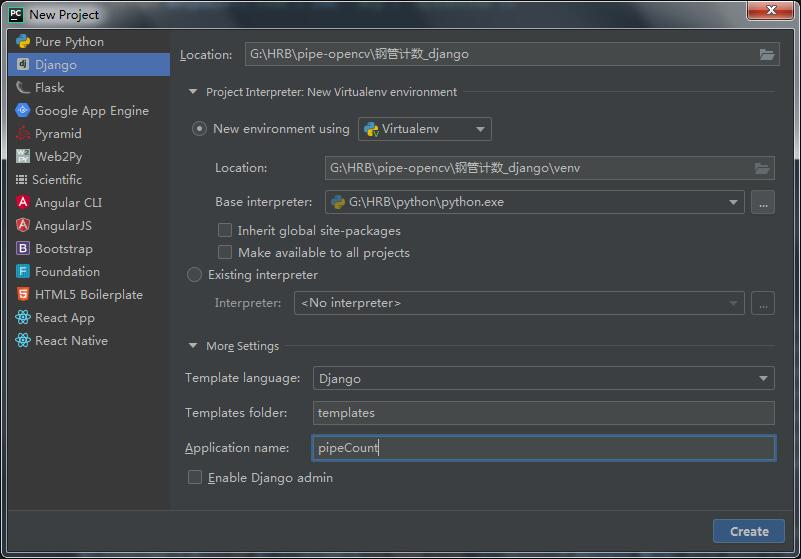

# 钢管计数-django

#### 介绍
钢管计数DJANGO后端版本，使用django框架进行开发。

onnx模型由YOLOV5_P6进行训练，当前模型所使用训练集图片均为不同环境下的钢管横截面照片，由于训练集有限，当前模型mAP大约为0.5-0.6。


#### 软件架构
Python 3.8.6

Django 3.2.15

Opencv-python 4.5.2.52

opencv-contrib-python 4.5.2.52

#### 安装教程

**本项目仅在Python3.8.6版本下进行测试运行，其他版本请自行测试！**

**Pycharm 中进行安装：**

1、  在pycharm中新建项目，选择Django，参数参考图片，根据个人pycharm配置不同参数也不同。



2、  使用pycharm终端安装opencv-python
```
pip install opencv-python==4.5.2.52 opencv-contrib-python==4.5.2.52
```

   安装完可使用“pip list”命令查看已安装的包。请确保红框内的包都正常安装！
    


#### 使用说明

**本地运行：**

1、  Pycharm终端中输入命令
```
python manage.py runserver
```
2、  在浏览器中输入地址打开链接
```
127.0.0.1:8000/finds/
``` 
3、  或点击终端中的地址打开链接


#### 参与贡献

1.  Fork 本仓库
2.  新建 Feat_xxx 分支
3.  提交代码
4.  新建 Pull Request


