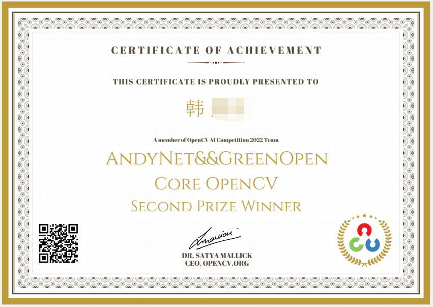
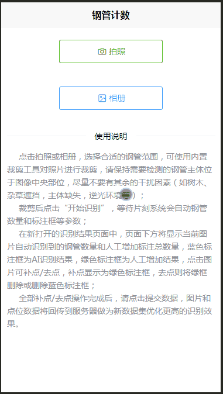
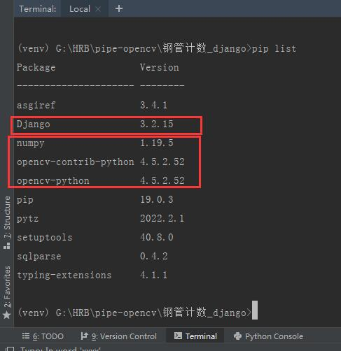
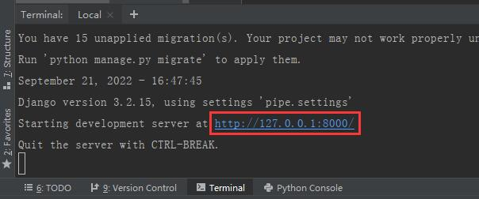
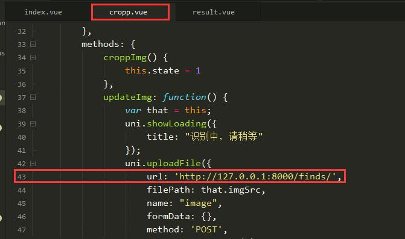
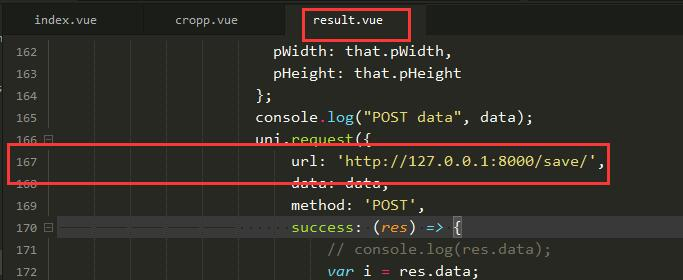
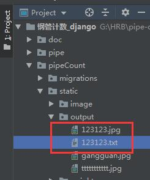

# 钢管计数-django

[README](README.md) | [English Doc](README_En.md)

 



### 恭喜该项目荣获国际性OpenCV 2022竞赛团队奖第二名！！！
### 项目组成员：禾老师+作者本人(AndyNet&&GreenOpen)

#### 介绍
钢管计数DJANGO后端版本，使用django框架进行开发。

该项目仅在Windows系统上进行开发调试，Linux和Mac系统请自行测试。

前端采用uniapp框架进行开发，该项目需配合作者的前端项目搭配使用，或您自己搭建其他前端，开放接口请看下方简介。

onnx模型由YOLOV5_P6进行训练，当前模型所使用训练集图片均为不同环境下的钢管横截面照片，由于训练集有限，当前模型mAP大约为0.5-0.6。

感谢禾路老师全程专业指导！

[专注图像处理-jsxyhelu](https://www.cnblogs.com/jsxyhelu)

前端项目：[钢管计数-uniapp](https://gitee.com/atvip/pipe_count_uniapp)

**PS: 该项目仅可做为学习研究所用，未经作者许可，不得用于商业用途！**




#### 软件架构
Python 3.8.6

Django 3.2.15

Opencv-python 4.5.2.52

opencv-contrib-python 4.5.2.52

#### 安装教程

**本项目仅在Python3.8.6版本下进行测试运行，其他版本请自行测试！**

**Pycharm 中进行安装：**

1、  在pycharm中新建项目，选择Python，参数根据个人pycharm配置不同，参数也不同。

2、  使用pycharm终端安装django和opencv-python
```
pip install django==3.2.15 opencv-python==4.5.2.52 opencv-contrib-python==4.5.2.52
```

   安装完可使用“pip list”命令查看已安装的包。请确保红框内的包都正常安装！
    


3、  克隆本项目

```
git clone https://gitee.com/atvip/pipe_count_django.git
```


#### 使用说明

**本地运行：**

1、  Pycharm终端中输入命令启动django服务
```
python manage.py runserver
```
2、  复制以下链接
```
http://127.0.0.1:8000/
``` 


3、  粘贴链接到前端替换（根据自己django部署方案链接可能有所不同）

注意API接口，目前开放两个接口，对应下方截图前端两个位置

```
http://www.xxx.com/finds   --->   钢管识别接口
http://www.xxx.com/save    --->   保存结果接口
``` 





4、  运行前端项目，最终结果提交后，将由后端程序自动生成YOLOV5格式数据集文件，文件名与用户上传图片文件名一致！

```
数据集路径：  项目根目录/pipeCount/static/output/
```



#### 参与贡献

1.  Fork 本仓库
2.  新建 Feat_xxx 分支
3.  提交代码
4.  新建 Pull Request 


