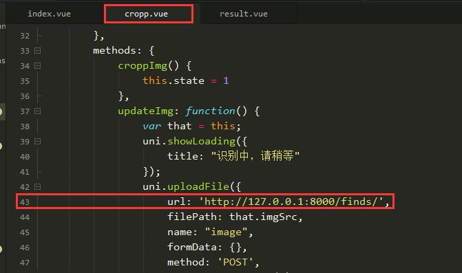
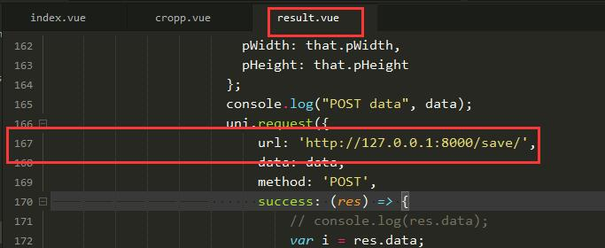

# pipe count-django

 


### Congratulations to this project for winning the second place in the International OpenCV 2022 Competition Team Award! ! !
### Project team members: MrHe + MrHan (AndyNet&&GreenOpen)

#### introduce
Steel pipe count DJANGO backend version, using django framework for development.

This project is only developed and debugged on the Windows system, please test the Linux and Mac systems by yourself.

The front-end is developed using the uniapp framework. This project needs to be used in conjunction with the author's front-end project, or you can build other front-ends yourself. Please see the introduction below for the open interface.

The onnx model is trained by YOLOV5_P6. The training set pictures used by the current model are all cross-sectional photos of steel pipes in different environments. Due to the limited training set, the mAP of the current model is about 0.5-0.6.

Thanks to Mr. Helu for his professional guidance throughout!

[Focus on image processing-jsxyhelu](https://www.cnblogs.com/jsxyhelu)

Front-end project: [pipe count-uniapp](https://github.com/mrhanCH/pipe_count_uniapp)

**PS: This project can only be used for study and research, without the author's permission, it cannot be used for commercial purposes! **


#### Software Architecture
Python 3.8.6

Django 3.2.15

Opencv-python 4.5.2.52

opencv-contrib-python 4.5.2.52

#### Installation Tutorial

**This project is only tested and run under Python3.8.6 version, please test other versions by yourself! **

**Install in Pycharm:**

1. Create a new project in pycharm, select Python, and the parameters are different according to the personal pycharm configuration.

2. Use the pycharm terminal to install django and opencv-python
```
pip install django==3.2.15 opencv-python==4.5.2.52 opencv-contrib-python==4.5.2.52
```

    After installation, you can use the "pip list" command to view the installed packages. Please make sure that the packages in the red box are installed normally!
    


3. Clone this project

```
git clone https://gitee.com/atvip/pipe_count_django.git
```


#### Instructions for use

**Run locally:**

1. Enter the command in the Pycharm terminal to start the django service
```
python manage.py runserver
```
2. Copy the link below
```
http://127.0.0.1:8000/
```


3. Paste the link to the front-end replacement (the link may be different according to your django deployment plan)

Pay attention to the API interface. Currently, two interfaces are open, corresponding to the two positions at the front end of the screenshot below.

```
http://www.xxx.com/finds ---> steel pipe identification interface
http://www.xxx.com/save ---> save the result interface
```





4. Run the front-end project. After the final result is submitted, the back-end program will automatically generate a dataset file in YOLOV5 format. The file name is the same as the file name of the image uploaded by the user!

```
Dataset path: project root directory/pipeCount/static/output/
```


#### Contribute

1. Fork this warehouse
2. Create a new Feat_xxx branch
3. Submit the code
4. Create a new Pull Request